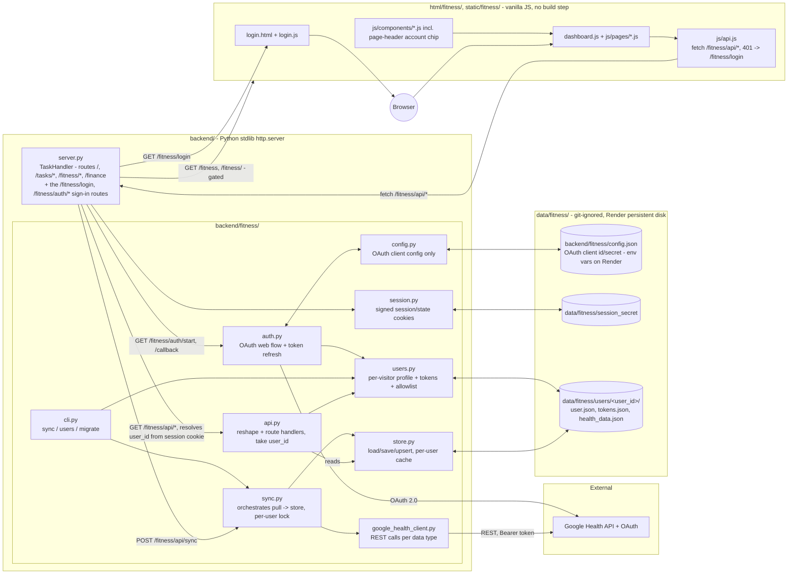

# Fitness — Architecture

How the ported `personal_health` app (see `README.md`) fits into this
repo's single stdlib `http.server` process. Ported 2026-08-23 from
[`agallagher55/personal_health`](https://github.com/agallagher55/personal_health)
(reviewed as of its own 2026-08-20 architecture review) — the system design
below is unchanged from that project, only the process boundary and file
locations moved.

## 1. System overview

A per-visitor personal health dashboard: any allowed visitor signs in with
their own Google account, and the app pulls their Google Health data,
caches it on disk under their own user id, and charts it in a browser. No
write-back to Google — strictly read-and-display. See
[`VISITOR-SIGNIN-PLAN.md`](VISITOR-SIGNIN-PLAN.md) for the sign-in design
this section now reflects.

## 2. Process boundary: one server, not two

The standalone `personal_health` app ran its own `ThreadingHTTPServer`
(`backend/cli.py serve`). Here, `backend/server.py`'s existing `TaskHandler`
(a `SimpleHTTPRequestHandler` subclass, dispatched via an if/elif chain on
`self.path` — see `routes.md`) owns the one process this whole app runs as.
Rather than running fitness as a second server, `backend/server.py`:

- adds `backend/fitness/` to `sys.path` once at import time, then
  `import api as fitness_api` (plus `auth`, `session`, `users` as
  `fitness_auth`/`fitness_session`/`fitness_users`) — the same flat-import
  style every module in `backend/fitness/` already uses (`import store`,
  `from config import ...`, etc.), just resolved from a subdirectory
  instead of `backend/` itself.
- routes `GET /fitness` and `GET /fitness/<page>` (`steps`, `heart-rate`,
  `sleep`, `activity`, `spo2`, `hrv`, `breathing-rate`, `temperature`,
  `weight`) to the matching file under `html/fitness/`, gated on
  `current_user_id()` (302 to `/fitness/login` if signed out).
- routes `GET /fitness/login`, `GET /fitness/auth/start`,
  `GET /fitness/auth/callback`, and `POST /fitness/auth/logout` to the
  sign-in flow methods on `TaskHandler` itself (cookie/session plumbing
  lives in `server.py`, not `backend/fitness/`, since it's specific to this
  app's one `http.server` process - see §4).
- routes everything under `GET /fitness/api/*` and `POST /fitness/api/sync`
  to plain functions in `backend/fitness/api.py` (`health(user_id)`,
  `me(user_id)`, `metrics_summary(user_id, query)`,
  `metric_detail(user_id, metric, query)`,
  `metric_samples(user_id, metric, query)`, `trigger_sync(user_id)`), each
  returning `(status_code, body_dict)` for `TaskHandler` to serialize.
  `user_id` is resolved from the session cookie before dispatch; every
  route except `/fitness/api/me` 401s if there isn't one.
- everything under `/static/fitness/*` falls through to the existing
  generic static-file serving (`SimpleHTTPRequestHandler`'s default
  `do_GET`), same as every other `/static/*` asset in this app.

`backend/fitness/api.py` is the one file that didn't exist standalone — it's
the original `backend/server.py`'s reshaping/route-handler logic (the
`_reshape_*` functions, `_parse_range`, `KNOWN_METRICS`/`SAMPLE_METRICS`,
etc.) extracted out of its `BaseHTTPRequestHandler` subclass into plain
functions, since this app's `TaskHandler` owns the actual socket/response
plumbing. `auth.py`, `http_client.py`, `google_health_client.py`, `store.py`,
`sync.py`, and `config.py` are otherwise byte-for-byte the same logic as the
standalone project, only `store.py`'s `DATA_PATH` and `config.py`'s
resolved location changed (see §3).

## 3. Storage

Everything is now per visitor except the OAuth client's own id/secret,
which every visitor shares. All of it lives under `data/fitness/`, which is
entirely git-ignored (see root `.gitignore`) and covered by the same
`render.yaml` persistent disk mount over `data/` — no deployment config
change was needed to add the new per-user paths:

- **`backend/fitness/config.json`** — OAuth **client** id/secret/redirect/
  scopes only, shared across every visitor. No longer holds tokens (see
  below). Read via `config.py`'s `load_client_config()`, which lets every
  field be supplied by an `FITNESS_GOOGLE_*`/`FITNESS_OAUTH_*` environment
  variable instead — required on Render, where this file (git-ignored) is
  never present in a deploy. Never committed (see `google_health.md`).
- **`data/fitness/session_secret`** — the HMAC key `session.py` signs
  cookies with. Generated on first use if `FITNESS_SESSION_SECRET` isn't
  set in the environment; rotating it invalidates every session.
- **`data/fitness/allowed_users.json`** (optional) — a JSON list of emails
  allowed to sign in, one of three ways to configure `users.is_allowed()`
  (see §4 and `VISITOR-SIGNIN-PLAN.md` §6).
- **`data/fitness/users/<user_id>/user.json`** — a visitor's profile
  (`google_sub`, `email`, `name`, `created`, `last_login`). `user_id` is
  `sha256(google_sub)[:16]`, derived server-side from Google's own stable
  account identifier, never from request input.
- **`data/fitness/users/<user_id>/tokens.json`** — that visitor's OAuth
  access/refresh tokens. Kept in its own file, separate from `user.json`,
  so `cli.py users`/`sync --all` can enumerate visitors without reading
  anyone's tokens, and so the frequently-rewritten token file can't corrupt
  the profile.
- **`data/fitness/users/<user_id>/health_data.json`** — that visitor's raw
  Google Health API points, grouped by metric name, plus `last_synced` per
  metric. Same shape as the pre-sign-in single-file store; only the path
  changed (`data/fitness/health_data.json` before, now nested per user —
  `cli.py migrate` moves the owner's original file into their own user
  directory, see §7 and `VISITOR-SIGNIN-PLAN.md` §8).

Every write (`store.save_store()`, `users.save_user()`/`save_tokens()`) goes
through `jsonfile.write_json_atomic()`: serialize and overwrite the whole
file, atomically, via a temp file + `os.replace()` — no indexing, no
locking, same characteristics (and same caveats) as this app's existing
`tasks.json` store described in `architecture_Review.md` §2. Reads have one
exception to "no indexing, no caching": `store.load_store_cached(user_id)`
(used by every `fitness_api.*` read endpoint, not `sync.py` — see §4) keeps
the last successfully-parsed store in memory per user for the life of the
process and only re-parses when that user's `health_data.json` mtime/size
changes, since re-parsing a file that only grows (see §6) on every single
request was making even just viewing the dashboard slow. One visitor
syncing never invalidates another's cached entry. `store.load_store(user_id)`
itself is still an uncached, full parse every call, used by `sync.py`,
which mutates its store in place across several Google API calls before
saving — sharing the read cache with it would let a concurrent request see
a sync that's only half-applied. Nothing evicts cache entries; fine at
family-and-friends scale.

## 4. Data flow

**Sign-in (new):** browser → `GET /fitness` with no session cookie →
`TaskHandler` 302s to `/fitness/login` → visitor clicks **Continue with
Google** → `GET /fitness/auth/start` mints a `state`, sets a signed
short-lived state cookie, 302s to Google's consent screen → visitor
approves → `GET /fitness/auth/callback?code=..&state=..` verifies the state
cookie, `auth.exchange_code_for_tokens(code)`, `auth.parse_id_token_claims()`
pulls `sub`/`email` out of the (unverified-signature, but
server-to-server-sourced) `id_token`, `users.is_allowed(email)` checks the
allowlist, `users.upsert_from_claims()` writes
`data/fitness/users/<user_id>/{user,tokens}.json`, and the response sets a
signed session cookie and 302s to wherever the visitor was headed. See
`VISITOR-SIGNIN-PLAN.md` §9 for the exact route table and failure-mode
`?error=` codes.

**Sync (write path):** `backend/fitness/cli.py sync [--user|--all]`
(scheduled/manual, per visitor or every visitor) or the **Sync now** button
(`POST /fitness/api/sync` → `TaskHandler.do_POST`, resolves `user_id` from
the session cookie, 401s if there isn't one → `fitness_api.trigger_sync(user_id)`
→ `sync.lock_for(user_id)` (non-blocking; 409 if already held) →
`sync.sync_all(user_id)`) → `auth.get_valid_access_token(user_id)` (refreshes
if needed, raises `ReauthRequired` if the refresh token is gone/revoked/
expired — turned into a 401 with `reauth_url` rather than a 500) →
`google_health_client.list_data_points()` per metric →
`store.add_data_points()` upserts into the in-memory dict →
`store.save_store(user_id, ...)` rewrites that visitor's whole file →
`last_synced[metric]` advanced only for metrics that succeeded this run
(per-metric try/except, so one failing metric doesn't drop every other
metric's results — see `sync.py`'s docstring).

**Query (read path):** browser → `GET /fitness/api/metrics` (or
`/metrics/{metric}`, `/metrics/{metric}/samples`) → `TaskHandler` resolves
`user_id` from the session cookie (401 if there isn't one) →
`fitness_api.*` loads that visitor's **entire** JSON file via
`store.load_store_cached(user_id)` (a fresh parse on the first call, or
after the file changes; the cached in-memory store otherwise), reshapes the
relevant metric's raw points into the `API-CONTRACT.md` shape, filters by
date range, and returns the body for `TaskHandler` to send as JSON. Nothing
is pre-aggregated — the reshape/filter work still runs every request, only
the disk read + JSON parse is cached, and only for that one visitor.

## 5. Frontend

Vanilla JS/HTML/CSS, no build step, ES modules loaded directly by the
browser — same as the rest of this app, and unchanged from the standalone
project's own frontend beyond path rewrites:

- `html/fitness/index.html` (dashboard) and `html/fitness/pages/*.html`
  (one per metric detail view) replace `frontend/index.html` and
  `frontend/pages/*.html`.
- `static/fitness/css/styles.css`, `static/fitness/js/*.js`,
  `static/fitness/js/components/*.js`, `static/fitness/js/pages/*.js`
  replace `frontend/css/`, `frontend/js/`.
- `static/fitness/js/api.js`'s `fetch()` base path is `/fitness/api/*`
  instead of `/api/*`; every other JS file's relative `import`s between
  siblings (`../charts.js`, `../components/stats-panel.js`, etc.) needed no
  changes, since the directory structure under `static/fitness/js/` mirrors
  the original `frontend/js/` layout exactly.
- Page-to-page links (dashboard card headings, each detail page's "←
  Dashboard" back-link) point at the clean `/fitness/<page>` routes
  `backend/server.py` now serves, instead of the standalone app's relative
  `pages/steps.html` file paths.
- Fitness pages keep their own self-contained design system
  (`static/fitness/css/styles.css` — card grid, dark-mode toggle, sparkline
  charts) rather than adopting the rest of this app's "sheet of paper"
  aesthetic (`static/styles/styles.css`); the two are deliberately not
  merged, same as `finance/ARCHITECTURE.md`'s plan for `/finance` once that
  lands. A `back-link` on the dashboard (`← Personal Super App`, styled with
  the existing `.back-link` class already used on every detail page) is the
  one navigation element added on top of the standalone app's own header,
  so a visitor can get back to `/`.
- `html/fitness/login.html` + `static/fitness/js/login.js` are new: the
  sign-in page, mapping `?error=` codes to a message and forwarding `?next=`
  onto the "Continue with Google" link.
- `static/fitness/js/components/page-header.js`'s `renderPageHeader()` (run
  by every fitness page) now also renders an account chip (signed-in email
  + a **Sign out** button), filled in by a non-blocking `getMe()` call.
- `static/fitness/js/api.js`'s `getJSON()`/`triggerSync()` redirect the
  browser to `/fitness/login` (or a sync's `reauth_url`) on a `401` instead
  of throwing an error no one would read.
- `dashboard.js` triggers one automatic sync on first load when the
  visitor's store is genuinely untouched (`data_store_last_modified ===
  null`), so a visitor who just signed in doesn't see nine empty cards with
  no explanation. Deliberately not done inside the OAuth callback itself —
  a synchronous multi-second Google pull inside a redirect would look like
  a hung sign-in.

## 6. What's unchanged from the standalone project (and its known gaps)

Everything in `personal_health`'s own architecture review still applies
here, since none of the logic moved changed behavior:

- Raw-payload storage (store exactly what Google returns, reshape at read
  time) rather than a normalized schema — deliberate, since several
  metrics' field shapes were still being reverse-engineered live against
  real API responses (see the per-metric comments in
  `backend/fitness/google_health_client.py` and `backend/fitness/api.py`).
- `temperature` reshaping is still unverified (no real synced data point to
  confirm the field-name guesses against as of the port date).
- No rate-limit/backoff handling against the Google Health API beyond
  per-metric `sync.py` isolation, no logging/observability beyond what's
  already silent in the original.
- Tokens (`data/fitness/users/<user_id>/tokens.json`) are still plaintext on
  disk, one file per visitor now instead of one shared `config.json` —
  acceptable at family-and-friends scale on a personal Render deployment,
  same caveat as `finance/ARCHITECTURE.md` §6 raises for Plaid credentials.
- Google refresh tokens expire after 7 days while the OAuth client's
  publishing status is "Testing" (see `google_health.md`), so a visitor is
  sent back through consent about weekly — handled (`ReauthRequired` → a
  401 with `reauth_url`, not a 500), but worth knowing going in.

Request-level auth on `/fitness/api/*` — the one gap this document
previously listed under "no auth of any kind" — is what
`VISITOR-SIGNIN-PLAN.md` implements: every `/fitness*` route now requires a
signed-in session except `/fitness/login`, `/fitness/auth/*`, and
`/fitness/api/me` (see §4). The remaining gaps above are carried over
unchanged from the standalone project and are worth revisiting together
with this app's other cross-cutting gaps (`architecture_Review.md` §8)
rather than fixed piecemeal just because this feature moved.

Automated tests now exist for the security-sensitive pure functions
(`backend/fitness/tests/` — signed-cookie round-tripping/tampering,
`is_allowed()`'s allowlist resolution, `parse_id_token_claims()`'s claim
validation), run via `python -m unittest discover -s backend/fitness/tests`.
Nothing else in the app has a test suite yet.
