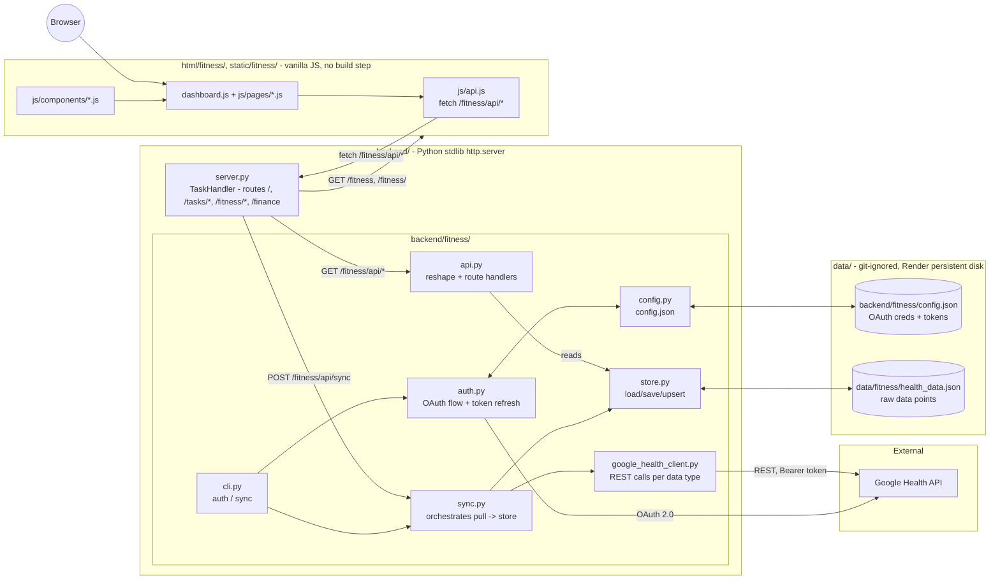

# Fitness — Architecture

How the ported `personal_health` app (see `README.md`) fits into this
repo's single stdlib `http.server` process. Ported 2026-08-23 from
[`agallagher55/personal_health`](https://github.com/agallagher55/personal_health)
(reviewed as of its own 2026-08-20 architecture review) — the system design
below is unchanged from that project, only the process boundary and file
locations moved.

## 1. System overview

A single-user, local-only personal health dashboard: pull data from the
Google Health API, cache it on disk, view it in a browser. No multi-user
concept, no write-back to Google — strictly read-and-display.

## 2. Process boundary: one server, not two

The standalone `personal_health` app ran its own `ThreadingHTTPServer`
(`backend/cli.py serve`). Here, `backend/server.py`'s existing `TaskHandler`
(a `SimpleHTTPRequestHandler` subclass, dispatched via an if/elif chain on
`self.path` — see `routes.md`) owns the one process this whole app runs as.
Rather than running fitness as a second server, `backend/server.py`:

- adds `backend/fitness/` to `sys.path` once at import time, then
  `import api as fitness_api` — the same flat-import style every module in
  `backend/fitness/` already uses (`import store`, `from config import ...`,
  etc.), just resolved from a subdirectory instead of `backend/` itself.
- routes `GET /fitness` and `GET /fitness/<page>` (`steps`, `heart-rate`,
  `sleep`, `activity`, `spo2`, `hrv`, `breathing-rate`, `temperature`,
  `weight`) to the matching file under `html/fitness/`.
- routes everything under `GET /fitness/api/*` and `POST /fitness/api/sync`
  to plain functions in `backend/fitness/api.py` (`health()`,
  `metrics_summary(query)`, `metric_detail(metric, query)`,
  `metric_samples(metric, query)`, `trigger_sync()`), each returning
  `(status_code, body_dict)` for `TaskHandler` to serialize.
- everything under `/static/fitness/*` falls through to the existing
  generic static-file serving (`SimpleHTTPRequestHandler`'s default
  `do_GET`), same as every other `/static/*` asset in this app.

`backend/fitness/api.py` is the one file that didn't exist standalone — it's
the original `backend/server.py`'s reshaping/route-handler logic (the
`_reshape_*` functions, `_parse_range`, `KNOWN_METRICS`/`SAMPLE_METRICS`,
etc.) extracted out of its `BaseHTTPRequestHandler` subclass into plain
functions, since this app's `TaskHandler` owns the actual socket/response
plumbing. `auth.py`, `http_client.py`, `google_health_client.py`, `store.py`,
`sync.py`, and `config.py` are otherwise byte-for-byte the same logic as the
standalone project, only `store.py`'s `DATA_PATH` and `config.py`'s
resolved location changed (see §3).

## 3. Storage

Two files, both git-ignored (see root `.gitignore`), both now under this
app's existing `data/`/`backend/` conventions instead of `personal_health`'s
own top-level `backend/`:

- **`backend/fitness/config.json`** — OAuth client id/secret, access/refresh
  tokens. Whole-file read/write via `config.py`, no schema validation, never
  committed (see `google_health.md`).
- **`data/fitness/health_data.json`** — raw Google Health API points, grouped
  by metric name, plus `last_synced` per metric. Alongside this app's other
  `data/*.json` files (`sections.json`, `tasks.json`, `tags.json`) and
  covered by the same `render.yaml` persistent disk mount over `data/`, so
  no deployment config changed to add this.

Every write (`store.save_store()`) serializes and overwrites the whole file
(atomically, via a temp file + `os.replace()`) — no indexing, no locking,
same characteristics (and same caveats) as this app's existing `tasks.json`
store described in `architecture_Review.md` §2. Reads have one exception to
"no indexing, no caching": `store.load_store_cached()` (used by every
`fitness_api.*` read endpoint, not `sync.py` — see §4) keeps the last
successfully-parsed store in memory for the life of the process and only
re-parses when `data/fitness/health_data.json`'s mtime/size changes, since
re-parsing that file (which only grows — see §6) on every single request
was making even just viewing the dashboard slow. `store.load_store()`
itself is still an uncached, full parse every call, used by `sync.py`,
which mutates its store in place across several Google API calls before
saving — sharing the read cache with it would let a concurrent request see
a sync that's only half-applied.

## 4. Data flow

**Sync (write path):** `backend/fitness/cli.py sync` (standalone, for
scheduled/manual syncs) or the **Sync now** button (`POST
/fitness/api/sync` → `TaskHandler.do_POST` → `fitness_api.trigger_sync()` →
`sync.sync_all()`) → `auth.get_valid_access_token()` (refreshes if needed)
→ `google_health_client.list_data_points()` per metric →
`store.add_data_points()` upserts into the in-memory dict →
`store.save_store()` rewrites the whole file → `last_synced[metric]`
advanced only for metrics that succeeded this run (per-metric try/except,
so one failing metric doesn't drop every other metric's results — see
`sync.py`'s docstring).

**Query (read path):** browser → `GET /fitness/api/metrics` (or
`/metrics/{metric}`, `/metrics/{metric}/samples`) → `TaskHandler` →
`fitness_api.*` loads the **entire** JSON file via `store.load_store_cached()`
(a fresh parse on the first call, or after the file changes; the cached
in-memory store otherwise), reshapes the relevant metric's raw points into
the `API-CONTRACT.md` shape, filters by date range, and returns the body for
`TaskHandler` to send as JSON. Nothing is pre-aggregated — the reshape/filter
work still runs every request, only the disk read + JSON parse is cached.

## 5. Frontend

Vanilla JS/HTML/CSS, no build step, ES modules loaded directly by the
browser — same as the rest of this app, and unchanged from the standalone
project's own frontend beyond path rewrites:

- `html/fitness/index.html` (dashboard) and `html/fitness/pages/*.html`
  (one per metric detail view) replace `frontend/index.html` and
  `frontend/pages/*.html`.
- `static/fitness/css/styles.css`, `static/fitness/js/*.js`,
  `static/fitness/js/components/*.js`, `static/fitness/js/pages/*.js`
  replace `frontend/css/`, `frontend/js/`.
- `static/fitness/js/api.js`'s `fetch()` base path is `/fitness/api/*`
  instead of `/api/*`; every other JS file's relative `import`s between
  siblings (`../charts.js`, `../components/stats-panel.js`, etc.) needed no
  changes, since the directory structure under `static/fitness/js/` mirrors
  the original `frontend/js/` layout exactly.
- Page-to-page links (dashboard card headings, each detail page's "←
  Dashboard" back-link) point at the clean `/fitness/<page>` routes
  `backend/server.py` now serves, instead of the standalone app's relative
  `pages/steps.html` file paths.
- Fitness pages keep their own self-contained design system
  (`static/fitness/css/styles.css` — card grid, dark-mode toggle, sparkline
  charts) rather than adopting the rest of this app's "sheet of paper"
  aesthetic (`static/styles/styles.css`); the two are deliberately not
  merged, same as `finance/ARCHITECTURE.md`'s plan for `/finance` once that
  lands. A `back-link` on the dashboard (`← Personal Super App`, styled with
  the existing `.back-link` class already used on every detail page) is the
  one navigation element added on top of the standalone app's own header,
  so a visitor can get back to `/`.

## 6. What's unchanged from the standalone project (and its known gaps)

Everything in `personal_health`'s own architecture review still applies
here, since none of the logic moved changed behavior:

- Raw-payload storage (store exactly what Google returns, reshape at read
  time) rather than a normalized schema — deliberate, since several
  metrics' field shapes were still being reverse-engineered live against
  real API responses (see the per-metric comments in
  `backend/fitness/google_health_client.py` and `backend/fitness/api.py`).
- `temperature` reshaping is still unverified (no real synced data point to
  confirm the field-name guesses against as of the port date).
- No request-level auth on `/fitness/api/*` — same posture as the rest of
  this app (`architecture_Review.md` §2's "no auth of any kind" finding
  applies equally here now).
- No automated tests, no rate-limit/backoff handling against the Google
  Health API, no logging/observability beyond what's already silent in the
  original.
- Secrets (`backend/fitness/config.json`) stored in plaintext, git-ignored
  — acceptable for a single local user/personal Render deployment, same
  caveat as `finance/ARCHITECTURE.md` §6 raises for Plaid credentials.

None of these are new risks introduced by the port; they're carried over
unchanged and are worth revisiting together with this app's other
cross-cutting gaps (`architecture_Review.md` §8) rather than fixed
piecemeal just because this feature moved.
