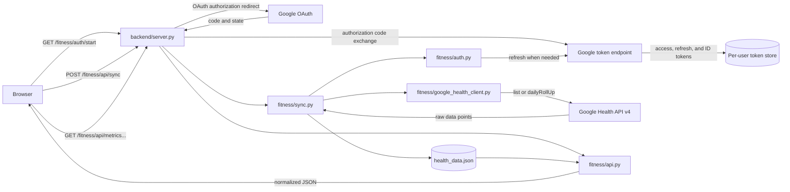

# Google Health API Integration Reference

This is the developer reference for how Personal Super App integrates with
Google Health API v4. Use it when debugging syncs or adding a new health
metric. It covers runtime behavior and extension points. For initial Google
Cloud and OAuth configuration, see [`google_health.md`](google_health.md). For
the complete response schemas exposed to the browser, see
[`API-CONTRACT.md`](API-CONTRACT.md).

Verified against the implementation and Google's official REST documentation
on 2026-09-10.

## At a glance

- Google service endpoint: `https://health.googleapis.com`
- API version used by this app: `v4`
- Google user selector: `users/me`, resolved from the OAuth access token
- Access model: read-only health scopes
- Initial sync range: today minus 30 days through today, inclusive
- Later sync range: each metric's last successful sync date through today
- Local store: `data/fitness/users/<user_id>/health_data.json`
- Browser API base: `/fitness/api`
- Only `POST /fitness/api/sync` contacts Google Health. All browser reads use
  the local per-user store.

The code-level sources of truth are:

| Concern | Source of truth |
|---|---|
| Google data type IDs, filters, page sizes, and read method | `backend/fitness/google_health_client.py` |
| OAuth scopes and client configuration | `backend/fitness/config.py` |
| Sync range, retry behavior, and per-user locking | `backend/fitness/sync.py` |
| Raw storage and deduplication | `backend/fitness/store.py` |
| Browser response shaping and supported metrics | `backend/fitness/api.py` |
| HTTP routing, cookies, and status codes | `backend/server.py` |

## End-to-end data flow



The app intentionally stores Google's raw data points. Conversion into stable,
frontend-friendly records happens only when `/fitness/api/*` is read. This
keeps the source payload available when a parser needs to be corrected or
expanded later.

## Authentication and authorization

### OAuth endpoints used

| Purpose | Method and endpoint | App code |
|---|---|---|
| Ask the user for consent | `GET https://accounts.google.com/o/oauth2/v2/auth` | `auth.build_authorization_url()` |
| Exchange an authorization code | `POST https://oauth2.googleapis.com/token` with `grant_type=authorization_code` | `auth.exchange_code_for_tokens()` |
| Refresh an access token | `POST https://oauth2.googleapis.com/token` with `grant_type=refresh_token` | `auth._refresh_access_token()` |

`/fitness/auth/start` creates a signed state cookie and redirects the browser
to Google. `/fitness/auth/callback` verifies that state, exchanges the code,
checks the returned identity claims and local allowlist, stores the user's
tokens, and issues a `fitness_session` cookie.

Access tokens are refreshed 60 seconds before their reported expiry. If the
refresh token is missing, expired, or revoked, the sync endpoint returns `401`
with `reauth_url: "/fitness/auth/start"`.

### Scopes requested by this app

| Scope | Used for |
|---|---|
| `openid email profile` | Identify the signed-in Google user |
| `googlehealth.activity_and_fitness.readonly` | Steps, calories, and exercise |
| `googlehealth.sleep.readonly` | Sleep sessions |
| `googlehealth.health_metrics_and_measurements.readonly` | Heart rate, SpO2, HRV, breathing rate, temperature, and weight |
| `googlehealth.nutrition.readonly` | Nutrition logs |

The full health scope prefix is
`https://www.googleapis.com/auth/googlehealth.`. Request only the minimum
scope needed for a feature. Adding a scope requires updating the app config,
the Google OAuth consent configuration, and existing users' consent.

## Google Health endpoints used by the sync

The client uses two methods from the
[`users.dataTypes.dataPoints`](https://developers.google.com/health/reference/rest/v4/users.dataTypes.dataPoints)
resource.

### List raw data points

```http
GET https://health.googleapis.com/v4/users/me/dataTypes/{dataType}/dataPoints
Authorization: Bearer <access-token>
```

Query parameters used:

| Parameter | Meaning |
|---|---|
| `filter` | A half-open time range: start is inclusive and end is exclusive |
| `pageSize` | `10000` for most types; `25` for sleep and exercise, which Google caps at 25 |
| `pageToken` | Returned by Google when another page exists |

The response uses `dataPoints` and may include `nextPageToken`. The client
continues until no token is returned.

Example filter for physical sample time:

```text
heart_rate.sample_time.physical_time >= "2026-09-04T00:00:00Z" AND
heart_rate.sample_time.physical_time < "2026-09-11T00:00:00Z"
```

Example filter for civil session time:

```text
nutrition_log.interval.civil_start_time >= "2026-09-04T00:00:00" AND
nutrition_log.interval.civil_start_time < "2026-09-11T00:00:00"
```

### Daily rollup

```http
POST https://health.googleapis.com/v4/users/me/dataTypes/{dataType}/dataPoints:dailyRollUp
Authorization: Bearer <access-token>
Content-Type: application/json
```

Request body used by the app:

```json
{
  "range": {
    "start": { "date": { "year": 2026, "month": 9, "day": 4 } },
    "end": { "date": { "year": 2026, "month": 9, "day": 11 } }
  },
  "windowSizeDays": 1
}
```

The response uses `rollupDataPoints` and may include `nextPageToken`.
`total-calories` is limited to 14 days per rollup request, so the client splits
longer ranges into consecutive chunks. The general documented rollup limit is
90 days for most other types, which the Steps implementation uses.

The app does not set `dataSourceFamily`, so Google uses its default of all
available sources.

## Implemented metric registry

The app's metric name is an internal stable identifier. The Google data type
ID is the exact hyphenated value used in the URL. Do not derive one from the
display label.

| App metric | Google data type ID | Operation | Time filter or range | Scope category | Important notes |
|---|---|---|---|---|---|
| `steps` | `steps` | `dailyRollUp` | Civil-day range; configured list filter `steps.interval.civil_start_time` is unused | Activity and fitness | Some devices return no useful raw step points, so the app requests daily totals |
| `calories` | `total-calories` | `dailyRollUp` | Civil-day range, maximum 14 days per request; configured list filter `total_calories.interval.civil_start_time` is unused | Activity and fitness | Total energy expenditure, including basal and active energy |
| `heart_rate` | `heart-rate` | `list` | `heart_rate.sample_time.physical_time` | Health metrics | Raw samples are retained and can be queried intraday |
| `sleep` | `sleep` | `list` | `sleep.interval.civil_end_time` | Sleep | Uses end time so a sleep is assigned to the waking day; page size is 25 |
| `activity` | `exercise` | `list` | `exercise.interval.civil_start_time` | Activity and fitness | Exercise sessions can contain a metrics summary; page size is 25 |
| `spo2` | `oxygen-saturation` | `list` | `oxygen_saturation.sample_time.physical_time` | Health metrics | Frontend displays a same-day average |
| `hrv` | `heart-rate-variability` | `list` | `heart_rate_variability.sample_time.physical_time` | Health metrics | Frontend displays a same-day average |
| `breathing_rate` | `daily-respiratory-rate` | `list` | `daily_respiratory_rate.date` | Health metrics | Daily summary type, filtered by bare civil date |
| `temperature` | `daily-sleep-temperature-derivations` | `list` | `daily_sleep_temperature_derivations.date` | Health metrics | Nightly skin-temperature variation, not core body temperature |
| `weight` | `weight` | `list` | `weight.sample_time.physical_time` | Health metrics | Frontend uses the last reading for each day |
| `food` | `nutrition-log` | `list` | `nutrition_log.interval.civil_start_time` | Nutrition | A user's logged food. The separate `food` type is a catalog, not the user's log |

The API may accept an endpoint while returning no data because data type
availability depends on the account, device, data source, and whether the
device was worn. A successful empty response is different from an unsupported
data type or unsupported operation error.

## Sync behavior

`sync.sync_all()` processes metrics sequentially:

1. Obtain or refresh the visitor's access token.
2. Load the visitor's raw store.
3. For each metric, choose its range:
   - Never synced: today minus 30 days through today.
   - Previously synced: the last successful sync date through today. The last
     day is deliberately fetched again because today's totals can change.
4. Call `google_health_client.list_data_points()`, which dispatches to `list`
   or `dailyRollUp` and follows pagination.
5. Upsert returned raw points by Google resource name, timestamp, civil rollup
   date, or a stable content hash when no identifier exists.
6. Advance `last_synced[metric]` only if that metric succeeded.
7. Atomically save the complete store and publish it to the in-process read
   cache.

A failure for one metric does not discard successful metrics. The HTTP sync
response remains `200` and includes an `errors` object for the failures. A
failed metric is retried from its previous `last_synced` date next time.

Only one sync per app user may run at a time. A concurrent request receives
`409`. Different users have separate locks and stores.

## Endpoints exposed by Personal Super App

These are the endpoints available to the browser or another same-origin
client. Detailed request and response examples live in
[`API-CONTRACT.md`](API-CONTRACT.md).

### JSON API

| Method | Endpoint | Authentication | Purpose |
|---|---|---|---|
| `GET` | `/fitness/api/me` | Optional | Current session identity and token presence |
| `GET` | `/fitness/api/health` | Session cookie | Store liveness and last-modified time |
| `GET` | `/fitness/api/metrics?from=YYYY-MM-DD&to=YYYY-MM-DD` | Session cookie | All normalized metrics; defaults to 7 days |
| `GET` | `/fitness/api/metrics/{metric}?from=YYYY-MM-DD&to=YYYY-MM-DD` | Session cookie | One normalized metric; defaults to 30 days |
| `GET` | `/fitness/api/metrics/heart_rate/samples?from=<ISO-8601>&to=<ISO-8601>` | Session cookie | Raw heart-rate samples inside an exact workout window |
| `POST` | `/fitness/api/sync` | Session cookie and same-origin check | Synchronously fetch all configured Google metrics |

Supported `{metric}` values are `steps`, `calories`, `heart_rate`, `sleep`,
`activity`, `spo2`, `hrv`, `breathing_rate`, `temperature`, `weight`, and
`food`. Only `heart_rate` currently supports the `/samples` form.

### Sign-in routes

| Method | Endpoint | Purpose |
|---|---|---|
| `GET` | `/fitness/login` | Serve the sign-in page |
| `GET` | `/fitness/auth/start` | Start Google OAuth and set the state cookie |
| `GET` | `/fitness/auth/callback` | Verify state, exchange the code, store tokens, and create the session |
| `POST` | `/fitness/auth/logout` | Clear the app session cookie |

All JSON responses set no-cache headers. Every JSON endpoint except
`/fitness/api/me` requires a valid `fitness_session` cookie.

## Google Health v4 capabilities not used yet

Google exposes more than this app currently calls. The official
[`v4 REST reference`](https://developers.google.com/health/reference/rest)
currently includes:

| Resource | Available methods | Current app usage |
|---|---|---|
| User data points | `list`, `get`, `reconcile`, `rollUp`, `dailyRollUp`, `create`, `patch`, `batchDelete`, `exportExerciseTcx` | `list` and `dailyRollUp` only |
| User profile and settings | Get identity, profile, IRN profile, and settings; update profile and settings | Not used |
| Paired devices | `get`, `list` | Not used |
| Project subscribers | `create`, `list`, `patch`, `delete` | Not used |
| Subscriber subscriptions | `create`, `list`, `patch`, `delete` | Not used |

Operations vary by data type. An operation appearing in the REST resource does
not mean every data type supports it. Check the operation column in Google's
[`data type table`](https://developers.google.com/health/data-types) before
implementation. Write operations also require the matching write-only scope
and should be treated as a separate product and security decision.

Likely future uses include:

- `rollUp` for sub-day aggregates such as workout windows.
- `reconcile` when a feature needs Google's reconciled stream instead of raw
  source points.
- `exportExerciseTcx` for detailed workout tracks.
- Subscribers and subscriptions for webhook-driven updates instead of manual
  full syncs.
- Paired-device reads to explain why a data type is unavailable for a user.

## Adding a new metric

Use this sequence to avoid a successful sync that still produces an empty or
broken card.

1. **Confirm Google support.** In the official data type table, record the
   exact URL ID, record type, supported operations, filter parameter, required
   scope, compatible devices, and webhook support.
2. **Choose the read shape.** Prefer `list` when raw samples or sessions are
   needed. Use `dailyRollUp` for daily totals or when real devices do not emit
   usable raw points. The current client has no `rollUp` wrapper, so add one if
   physical-time aggregation is required.
3. **Add the least-privilege scope if needed.** Update
   `config.DEFAULT_SCOPES`, `config.json.example`, the OAuth consent screen,
   and deployment configuration. Existing users must authorize the new scope.
4. **Register the Google request.** Add an entry to
   `google_health_client.DATA_TYPES` with `api_id`, `filter_field`,
   `time_kind`, `page_size`, and optional `read_method` and
   `max_rollup_days`.
5. **Verify the raw payload.** Sync a narrow range and inspect field names and
   units in a sanitized sample. Do not commit tokens or raw personal data.
6. **Add backend shaping.** Add the metric to `api.KNOWN_METRICS`, implement a
   `_point_date_*` extractor and `_reshape_*` function, then register both in
   `_POINT_DATE_EXTRACTORS` and `_RESHAPERS`.
7. **Check deduplication.** Confirm `store._point_key()` can distinguish the
   new data points. Add a metric-specific key strategy if resource name, time,
   civil start, and content hash are insufficient.
8. **Expose the frontend.** Add the HTML container or detail page, API call,
   renderer, units, labels, empty state, and navigation as appropriate.
9. **Document the contract.** Update this registry and
   `API-CONTRACT.md`, including nullability and units.
10. **Test each layer.** Cover URL and filter construction, pagination or
    rollup chunking, raw-to-normalized parsing, date boundaries, empty data,
    malformed points, and frontend rendering.

## Common failure modes

| Symptom | Likely cause | Check |
|---|---|---|
| `INVALID_PARENT_DATA_TYPE_COLLECTION` | Wrong URL data type ID | Use the exact hyphenated ID from Google's data type table, such as `total-calories` or `nutrition-log` |
| `UNSUPPORTED_DATA_TYPE_ACTION` | The type does not support `list`, `rollUp`, or `dailyRollUp` | Check the documented operations for that data type |
| Filter member is not supported | Filter field or time representation is wrong | Match Google's filter parameter and record type; distinguish physical timestamp, civil datetime, and daily date |
| `401` during sync | Missing, expired, or revoked refresh token | Re-enter through `/fitness/auth/start`; see the testing-mode expiry note in `google_health.md` |
| `403` or insufficient permission | Required scope was not granted | Compare token scopes with `config.DEFAULT_SCOPES` and request consent again |
| Successful response with zero points | No compatible device/source data, wrong range, or the device only exposes a rollup | Verify device compatibility and compare `list` with the supported rollup operation |
| Only the first page appears | Pagination was not followed | Continue with `nextPageToken` while keeping the original request fields unchanged |
| Data fetched but card is blank | Metric not registered or renderer not called | Trace `DATA_TYPES` to storage, `KNOWN_METRICS`, reshaper, API response, and frontend renderer |

## Official references

- [REST API index](https://developers.google.com/health/reference/rest)
- [Endpoint patterns and examples](https://developers.google.com/health/endpoints)
- [Data types, operations, scopes, filters, and device compatibility](https://developers.google.com/health/data-types)
- [`dataPoints.list`](https://developers.google.com/health/reference/rest/v4/users.dataTypes.dataPoints/list)
- [`dataPoints.dailyRollUp`](https://developers.google.com/health/reference/rest/v4/users.dataTypes.dataPoints/dailyRollUp)
- [`dataPoints.rollUp`](https://developers.google.com/health/reference/rest/v4/users.dataTypes.dataPoints/rollUp)
- [OAuth scopes](https://developers.google.com/health/scopes)
- [Error catalog](https://developers.google.com/health/reference/rest/v4/errors)
- [Discovery document](https://health.googleapis.com/$discovery/rest?version=v4)
- [Release notes](https://developers.google.com/health/release-notes)
